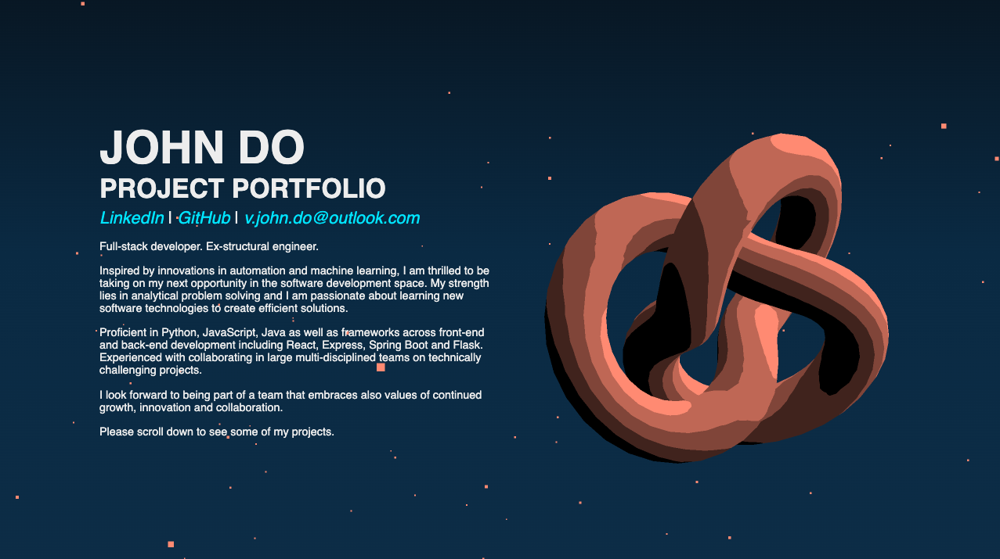
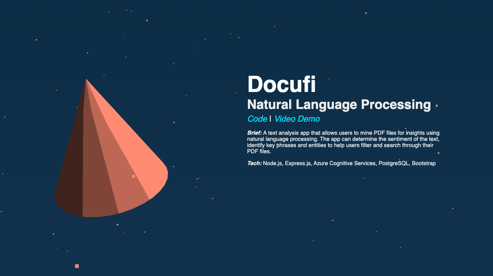
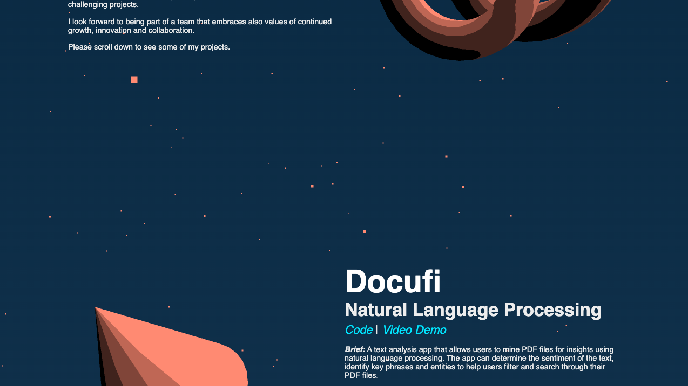

# 3D Portfolio Website

This project portfolio website was built using Three.js and served using webpack. The camera tranlsates against scrollwheel inputs, animated objects rotate based on the location of the viewport and background particles moved based on the mouse cursor.

>Landing page

>Project view

>Translating camera effect while scrolling

## Setup for local development

- Clone the repo
    >`git@github.com:vjohndo/personal-website.git`
- Install the dependencies
    >`npm i`
- Run the webpack
    >`npm run dev`

## Technologies used
- Javascript / HTML / CSS
- Three.js
- Webpack

## References 
- [https://threejs-journey.com/](https://threejs-journey.com/)